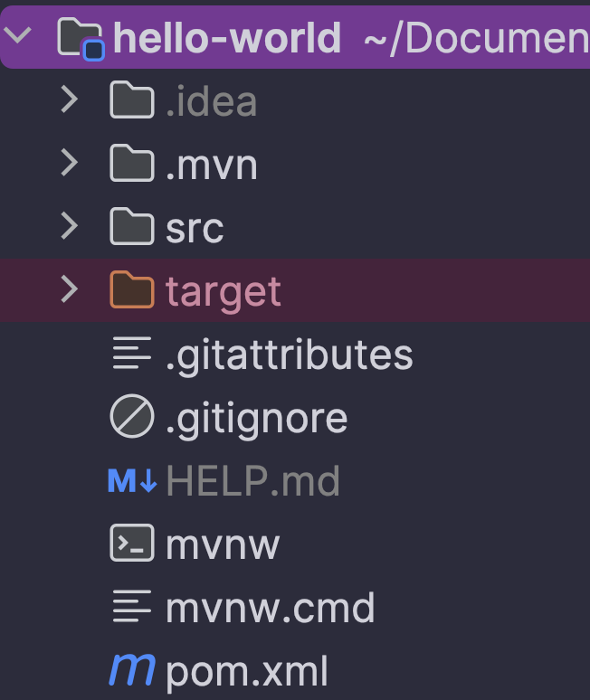

# Spring Boot Fundamentals Training - ITM Gwalior

## **Duration**: 4 hours per day x 6 days (24 hours total)

### Day 2 : Spring Boot Fundamentals

#### Session 1 (2 hours) : Project setup, application properties, auto-configuration

* **Spring Boot Project Setup** (60 minutes)
	* [Spring Initializr (start.spring.io)](./README.md#spring-initializer-startspringio)
	* [Maven project structure](./README.md#maven-project-structure)
	* [POM configuration and dependencies](./README.md#pom-configuration-and-dependencies)
	* [application.properties/YAML configuration](./README.md#applicationpropertiesyaml-configuration)

* **Spring Boot Core Concepts** (60 mintues)
	* [@SpringBootApplication anatomy](./README.md#springbootapplication-anatomy)
	* [Component scanning](./README.md#component-scanning)
	* [Auto-configuration](./README.md#auto-configuration)
	* [Profiles for environment specific configuration](./README.md#profiles-for-environment-specific-configuration)

#### Session 2 (2 hours) : Dependency Injection, component scanning, bean lifecycle

* **Dependency Injection in Spring Boot** (90 minutes)
	* [Bean lifecycle](./README.md#bean-lifecycle)
	* [@Component, @Service, @Repository annotations](./README.md#component-service-repository-annotations)
	* [@Autowired and constructor injection](./README.md#autowired-and-constructor-injection)
	* [Scopes of Spring beans (Singleton vs Prototype)](./README.md#scopes-of-spring-beans-singleton-vs-prototype)
	* [Building a simple service layer](./README.md#building-a-simple-service-layer)

* [**Practical Exercise**](./README.md#practical-exercise) (30 minutes)
	* Create a Spring Boot application with multiple components
	* Configure beans with different injection methods
	* Test bean initialization and dependency injection

---

### Spring Initializer (start.spring.io)

[**Developing your First Spring Boot Application** (Spring Docs)](https://docs.spring.io/spring-boot/tutorial/first-application/index.html)

**Step 1: Install Java JDK (21 - LTS)**

If you have downloaded IntelliJ IDEA (Ultimate), it comes pre-installed with the latest version of the GA (Generally Available)
JDK, which right now is Java OpenJDK 24, but we need to install Java JDK 21 (LTS - Long Term Support). 

Press `ctrl + alt + shift + S` on Windows OR `cmd + ;` on a Mac to open the "Project Structure Window"

Make sure the **SDK:** is set to Java `21` (whichever flavor is available, OpenJDK/Amazon Coretto etc)

Make sure the **Language Level:** is set to `SDK default`.

click on `apply` and then click on `ok`.

**Step 2: Go to the [Spring Initializr Website](start.spring.io)**

Go to the link given above and fill the details as mentioned below

- Project: `Maven`
- Language: `Java`
- Spring Boot: `3.4.4`
- Project Metadata
  - group: **io.github.`<your-github-username>`** (without any special characters)
  - Artifact: `hello-world`
  - Name:` hello-world`
  - Description: `Hello World Spring Boot Application`
  - Package name: **io.github.`<your-github-username>`.hello.world**
  - Packaging: `jar`
  - Java: `21`
- Dependencies: `Spring Web`

You can also use 
[this link](https://start.spring.io/#!type=maven-project&language=java&platformVersion=3.4.4&packaging=jar&jvmVersion=21&groupId=io.github.dbc2201&artifactId=hello-world&name=hello-world&description=Hello%20World%20Spring%20Boot%20Application&packageName=io.github.dbc2201.hello.world&dependencies=web) to autofill the details. Just remember to use **YOUR OWN GITHUB USERNAME** instead of `dbc2201`.

To add the dependencies, click on the `Add Dependencies...` button on the top-right hand side corner of the website,
and search for `Spring Web`, then click on it or select it and press `enter`.

Your first Spring Boot application is now ready, you can now click on the `Generate` button.

The website will download a `hello-world.zip` file on your computer, save it to a folder you can remember.

Open the folder where you have downloaded the `hello-world.zip` file and "unzip" the file, this will reveal a folder called `hello-world`.

You can now open your IntelliJ IDEA and open this folder. This will open the Spring Boot application in your IntelliJ IDEA.

`Congratulations! You have just taken the first step towards becoming a Spring Boot Java Developer!!`

### Maven project structure

* [Build Systems (Spring Docs)](https://docs.spring.io/spring-boot/reference/using/build-systems.html)
* [Structuring Your Code (Spring Docs)](https://docs.spring.io/spring-boot/reference/using/structuring-your-code.html)
* [Maven Plugin (Spring Docs)](https://docs.spring.io/spring-boot/maven-plugin/index.html)

You can open the **"Project View"** by pressing `cmd + 1` on a Mac or `alt + 1` on Windows.

Inside the **"Project View"** you will be able to see all the files and folders related to your Spring Boot application.

We will focus on the `pom.xml` file right now.
Since you selected `Maven` as the "build system" for your Spring Boot project, you have this `pom.xml` file in your project view (or inside your project folder).

#### What is `pom.xml` in a Spring Boot application?

The `pom.xml` file is like a **recipe book** for your Spring Boot project. It tells **Maven** (a tool that builds and manages your Java projects) what your project needs to work.

#### What does it include?

1. **Project Info**
	- Name of the project
	- Version of the project
	- Who made it

2. **Dependencies**  
   These are **libraries** or **tools** your project needs — for example:
	- Spring Boot (to run your app)
	- Thymeleaf (for HTML templates)
	- MySQL (to connect to a database)
	- Web or Security modules

   Instead of downloading these by hand, you just list them, and Maven downloads them for you automatically.

3. **Plugins**  
   These help with extra tasks like:
	- Running the Spring Boot app
	- Building the project into a `.jar` file

4. **Build Settings**  
   It tells Maven **how to compile**, **package**, and **run** your project.

#### Why is `pom.xml` important?

Without it:
- You’d have to manually download and set up a bunch of files and libraries.
- Your code might not run because of missing tools or wrong versions.

With it:
- Everything is organized and automatic.
- You can share your project with others, and they can run it easily too.

---

### POM configuration and dependencies

#### **What is POM Configuration?**

**POM** stands for **Project Object Model**. It’s the main file in a Maven project — saved as `pom.xml`.

**POM configuration** means setting up your project’s basic details and instructions in this file, such as:
- Project name and version
- Java version
- Build settings
- What tools and libraries (called *dependencies*) your project needs

It tells Maven how to **build, run, and manage** your project.

#### **What are Dependencies?**

**Dependencies** are like ready-made tools or code written by others that your project needs to work.

For example:
- `spring-boot-starter-web` helps you build web apps
- `spring-boot-starter-data-jpa` helps you connect to databases
- `mysql-connector-java` lets your app talk to MySQL

Instead of writing all this from scratch, you just **add a few lines to your `pom.xml`**, and Maven downloads everything for you.

#### **Why is this useful?**

- No need to manually download libraries.
- Easy to manage versions and updates.
- Makes your project clean, portable, and easy to share.

---

### application.properties/YAML configuration

#### What is application.properties or application.yml?
In a Spring Boot application, application.properties or application.yml is a special file used to configure how your
application behaves. It allows you to set values that your code can use, such as:
- Server settings (like the port number)
- Database connection details 
- Custom variables (like a student name)
- Logging settings 
- Feature toggles

Spring Boot reads this file when your app starts and uses the settings inside.

---

### @SpringBootApplication anatomy

### Component scanning

### Auto-configuration

### Profiles for environment specific configuration

### Bean lifecycle

### @Component, @Service, @Repository annotations

### @Autowired and constructor injection

### Scopes of Spring beans (Singleton vs Prototype)

### Building a simple service layer

---

## Practical Exercise